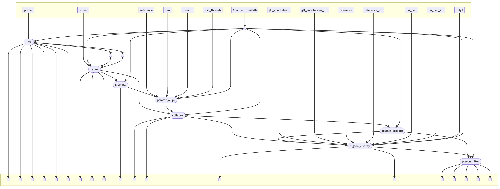

Nextflow pipeline for IsoSeq  data [IsoSeq.how](https://isoseq.how/)



Entrypoint to the pipeline is `main.nf`. The example samplesheet references a test dataset listed [here](https://downloads.pacbcloud.com/public/dataset/Kinnex-full-length-RNA/DATA-EXAMPLE/) from PacBio.

```
nextflow run main.nf --samplesheet example-isoseq-samplesheet-80k.csv
```

Preferably, you can run the pipeline on Seqera Platform. See the [documentation](https://docs.seqera.io/platform-cloud/getting-started/quickstart-demo/launch-pipelines) on how to set it up. 


